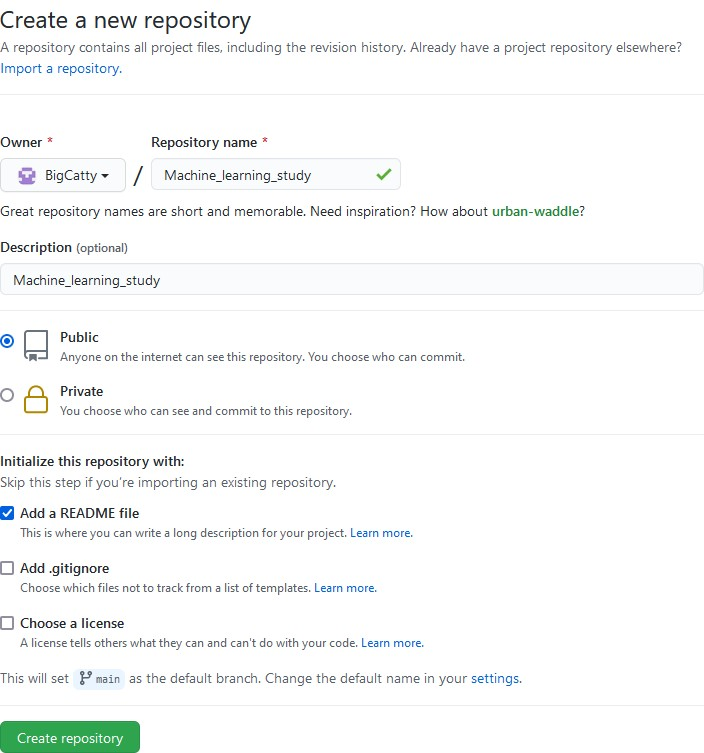

# 学习笔记
## 机器学习
### 简介
```python
# numpy 数据
import numpy as np
# 读取文件
import pandas as pd
# 机器学习框架
import torch
# 数据预处理
import sklearn
```
##  其他笔记
### 关于python
1. 模块（包）的操作
```python
# 安装
pip install xxx 
# 使用国内镜像源（快）
pip install -i https://pypi.tuna.tsinghua.edu.cn/simple xxx
# 查看
pip list
# 卸载
pip uninstall xxx
```
2. 关于numpy
* python默认数据类型为list
* numpy默认数据类型为ndarray
* list到ndarray`np.array(xxx)`
* ndarray到list`xxx.tolist()`
* 生成数据
```python
# 指定端点及步长
# np.arange(start=..., stop=..., step=...)
a = np.arange(0, 30, 2)
print(a)
# 指定端点及数目
# np.linspace(start, stop, num=50, endpoint=True)
b = np.linspace(0, 100, 11)
print(b)
```

### 关于git和github
1. 创建代码库

2. 拉取远程代码库
```python
# 打开github目标仓库，复制URL
# 在目标文件夹中右键打开git bash对话框输入
git clone URL
```
3. 提交修改

### 关于markdown
* 详见`Markdown.md`